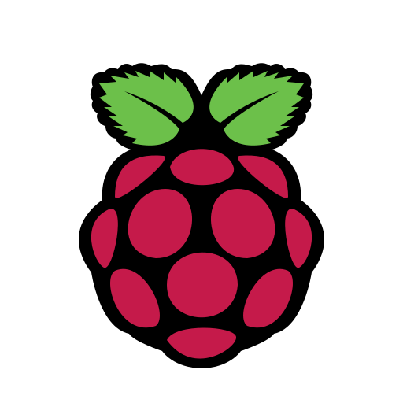

## Hello I'm Katya :wave:

  
    
  <samp>
    Currently I'm studying at <a href="https://www.hive.fi/en/about-hive">@ Hive Helsinki :school: </a> and being on my way to become software developer:computer:. Interested in working on backend, API's, Databases and currently learning about algorithms. Occasionaly I do participate in Hackathons :bulb: and I have a love/hate relationship with Chess :neutral_face:
  </samp>

### Programming Languages  :rocket:
| |  |  |  | 
|:---:|:---:|:---:|:---:|

### Tools :fire:
| |  |  |  |  | 
|:---:|:---:|:---:|:---:|:---:|

### Connect with me :smiley:

  

<!--   -->

